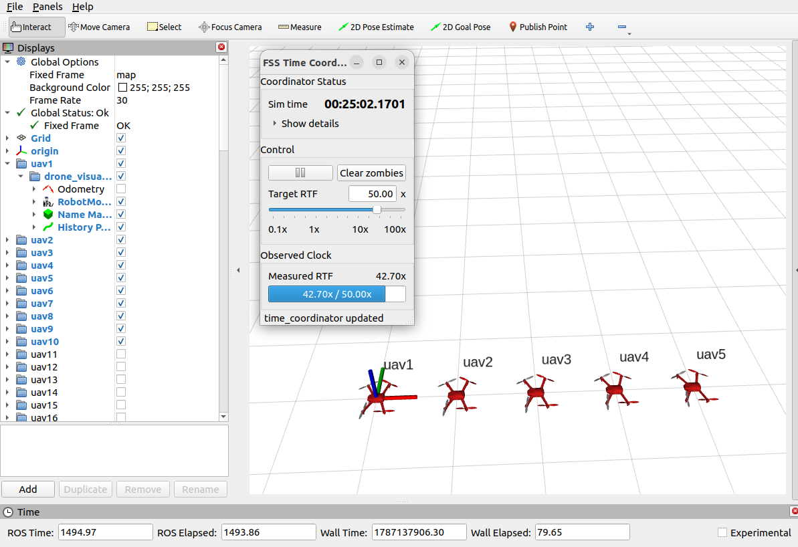
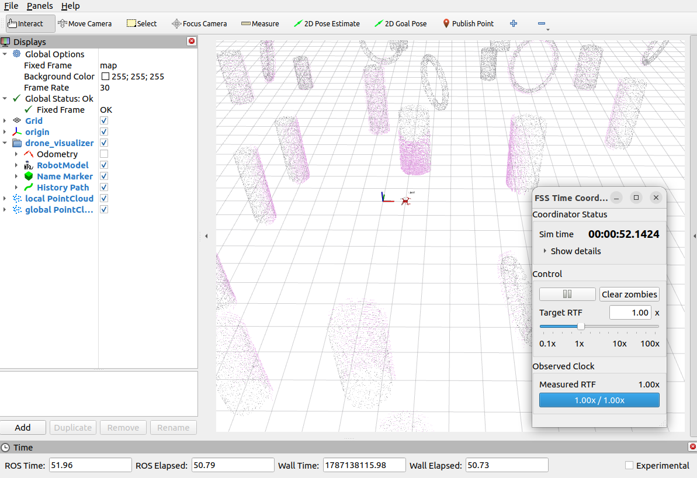

# FastSwarmSim

FastSwarmSim (fss) is a lightweight ROS 2 simulator for PX4-compatible multi-rotor vehicles. It combines a streamlined PX4 runtime, MAVROS-compatible ROS interfaces, local LiDAR point-cloud rendering, RViz visualization, and a conservative lock-step simulation clock. The simulator is intended for multi-UAV algorithm development, repeatable simulation-time experiments, and large-scale swarm prototyping.

**Performance:**
On a desktop-class computer with LiDAR simulation disabled, FastSwarmSim can run a single vehicle at up to 100x real time, five vehicles at 50x, ten vehicles at 30x, and one hundred vehicles at 4x. This performance comes from the trimmed PX4 core, lightweight MAVROS modules, and efficient lock-step simulation-time system.

## Packages

| Package | Purpose |
| --- | --- |
| `fss_bringup` | Integrated launch files for complete single- and multi-drone PX4/LiDAR/RViz simulations. |
| `fss_px4_sim` | PX4-based quadrotor simulation runtime, MAVROS Lite bridge, ideal quadrotor dynamics, MAVROS-compatible perfect-drone baseline, and RViz vehicle visualization. |
| `fss_sensing` | Local LiDAR point-cloud simulator. It renders the visible cloud from a vehicle pose against a static PCD map through the bundled `marsim_render` library. |
| `fss_time` | ZeroMQ-based conservative lock-step time coordinator, `/clock` publisher, simulation-speed controls, and C++ helpers/executors for time-synchronized ROS 2 nodes. **NOT only for FastSwarmSim, but for all types of ROS nodes**  |
| `fss_time_interfaces` | ROS 2 message and service definitions used by `fss_time`, including simulation clock control interfaces. |

The standard PX4 simulation uses a trimmed PX4 v1.13.3 control stack with MAVROS Lite. For algorithm tests that do not require PX4 control or vehicle dynamics, the perfect-drone launch provides immediate MAVROS-compatible command tracking.

## Installation

The project is developed for Ubuntu 22.04 with ROS 2 Humble. Ubuntu 24.04 with ROS 2 Jazzy follows the same process, although package names can differ by ROS distribution.

Install ROS 2, `colcon`, and `rosdep` by following the [ROS 2 installation guide](https://gitee.com/shu-peixuan/install_ros2). The guide also includes solutions for common network issues.

Initialize `rosdep` once on a new machine, then clone and build the workspace. `rosdep install` resolves the required system and ROS dependencies:

```bash
sudo rosdep init
rosdep update

git clone https://github.com/shupx/FastSwarmSim.git

# for chinese users
git clone https://gitee.com/shu-peixuan/FastSwarmSim.git  

cd FastSwarmSim

source /opt/ros/$ROS_DISTRO/setup.bash
rosdep install --from-paths src --ignore-src -r -y
colcon build --symlink-install
source install/setup.bash
```

Source `install/setup.bash` in every new terminal before running the commands below. 

## Common Launch Commands

### [Time coordinator](src/fss_time/README.md)

```bash
ros2 launch fss_time time_coordinator.launch.py
```

Set a maximum simulation speed when needed:

```bash
ros2 launch fss_time time_coordinator.launch.py max_real_time_factor:=2.0
```

### [PX4 and perfect-drone simulation](src/fss_px4_sim/README.md)

```bash
ros2 launch fss_px4_sim px4_rotor_sim_single.launch.py
ros2 launch fss_px4_sim px4_rotor_sim_multi.launch.py num_drones:=5
ros2 launch fss_px4_sim perfect_mavros_drone_swarm.launch.py num_drones:=5
```



### [Local LiDAR point cloud](src/fss_sensing/README.md)

```bash
ros2 launch fss_sensing fss_local_pointcloud_sim.launch.py
```

### [Integrated PX4, LiDAR, and RViz scenes](src/fss_bringup/README.md)

```bash
ros2 launch fss_bringup sim_px4_drone_lidar_single.launch.py
ros2 launch fss_bringup sim_px4_drone_lidar_multi.launch.py num_drones:=3
```



## Further Documentation

- [Time coordination and multi-machine setup](src/fss_time/README.md)
- [Local point-cloud configuration and DDS tuning](src/fss_sensing/README.md)
- [PX4 simulator capabilities and scaling notes](src/fss_px4_sim/README.md)
- [Integrated PX4/LiDAR launch details](src/fss_bringup/README.md)
- [Time-coordinator test cases](src/fss_time/test_cases/README.md)

Run the test suite with:

```bash
colcon test
colcon test-result --verbose
```
